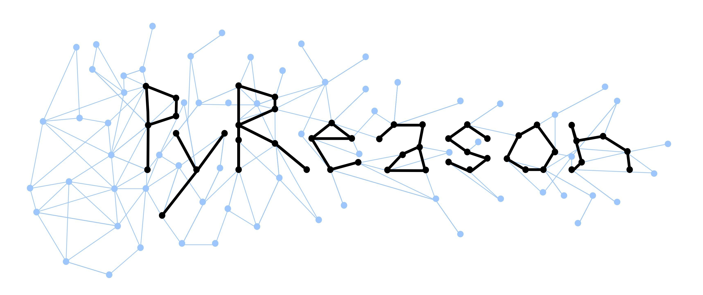

# PyReason


An explainable inference software supporting annotated, real valued, graph based and temporal logic. 

Check out the [PyReason Hello World](docs/hello-world.md) program if you're new, or want get get a feel for the software.


## Table of Contents
  
1. [Usage](#1-usage)
2. [Setup & Run](#2-setup--run)
    * [Setup & Run on the ASU Agave Cluster (interactive)](#21-setup--run-on-the-asu-agave-cluster-interactive)
    * [Setup & Run on the ASU Agave Cluster (sbatch)](#22-setup--run-on-the-asu-agave-cluster-sbatch)
    * [Setup & Run on your Local System](#23-setup--run-on-your-local-system)


## 1. Usage
To run pyreason you need 4 files:

1. A YAML file containing the pyreason rules
2. A YAML file containing the pyreason facts
3. A YAML file containing the pyreason labels
4. A YAML file containing the pyreason ipl (inconsistent predicate list)

The format of these files is very important. Please refer to the [example YAML files provided](pyreason/examples/example_yamls/) when making your own rules/facts/labels/ipl.


## 2. Setup & Run
There are three ways of running PyReason:
1. interactive session (on the Agave cluster)
2. sbatch (on the Agave cluster)
3. locally

To Run pyreason, the required command line arguments are:

1. The path to a graphml file
2. The number of timesteps you want to run the diffusion
3. The path to the YAML rules file
4. The path to the YAML facts file
5. The path to the YAML labels file
6. The path to the YAML ipl file

For more optional command line arguments refer to (make doc) or type 
```python
python3 -m pyreason.scripts.diffuse -h
```

### 2.1 Setup & Run on the ASU Agave Cluster (interactive)
To create an Anaconda environment and activate it, and then clone the repository, type the following in your Agave terminal. 

NOTE: This only needs to be done once. Once you've setup your environment you can run the interactive session directly.
```bash
module load anaconda/py3
conda create -n PYREASON
source activate PYREASON
git clone https://github.com/lab-v2/pyreason
cd pyreason
pip3 install -r requirements.txt
```
Now create an interavtive session with:
```bash
interactive -N 1 -n 45 -p htc -t 0-00:10:00
```
This starts an interactive session using 45 cores on one node for 10 minutes. You can change the time parameter based on your needs.

To run PyReason, type the following in your Agave terminal. Make sure you are in the top pyreason directory. Don't forget to replace the placeholders with the correct values.
```bash
python3 -m pyreason.scripts.diffuse --graph_path <path/to/graphml/file> --timesteps <number of timesteps to run> --rules_yaml_path <path/to/rules.yaml> --facts_yaml_path <path/to/facts.yaml> --labels_yaml_path <path/to/labels.yaml> --ipl <path/to/ipl.yaml>
```


### 2.2 Setup & Run on the ASU Agave Cluster (sbatch)
Open the run_on_agave.sh in a text editor, and modify the paths for the graph file, the rules file, the facts file, the labels file and the ipl file. Specify the number of timesteps to run for. Then in your Agave terminal, type:
```bash
sbatch run_on_agave.sh
```
This will submit a job to the cluster. You will be able to find the output of the program in the output folder.

### 2.3 Setup & Run on your Local System
Clone the repository and install the necessary packages to make pyreason run

```bash
git clone https://github.com/lab-v2/pyreason
cd pyreason
pip3 install -r requirements.txt
```
To run PyReason, type the following in your Agave terminal. Make sure you are in the top pyreason directory. Don't forget to replace the placeholders with the correct values.
```bash
python3 -m pyreason.scripts.diffuse --graph_path <path/to/graphml/file> --timesteps <number of timesteps to run> --rules_yaml_path <path/to/rules.yaml> --facts_yaml_path <path/to/facts.yaml> --labels_yaml_path <path/to/labels.yaml> --ipl <path/to/ipl.yaml>
```