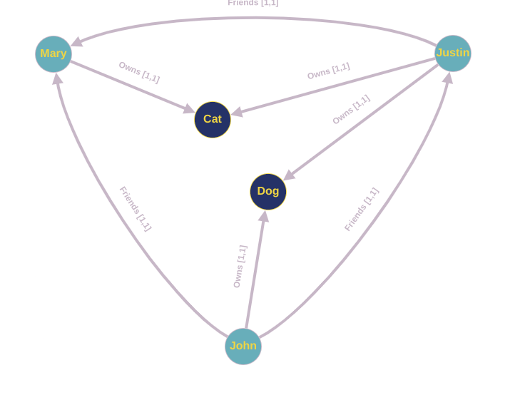

# PyReason Hello World! 🚀

Welcome to PyReason! In this document we outline a simple program that demonstrates some of the capabilities of the software. If this is your first time looking at the software, you're in the right place.

The following graph represents a network of people and the pets that they own. 



1. Mary is friends with Justin
2. Mary is friends with John
3. Justin is friends with John

And
1. Mary owns a cat
2. Justin owns a cat and a dog
3. John owns a dog


Let's assume that a person's popularity (for illustration 😀) is determined by whether they have AT LEAST ONE friend who is popular AND who has the same pet that they do. If this is true, then they are considered popular.
This will be represented as a Rule later on.

PyReason needs a few things to run:
1. A Graph (or knowledge base)
2. Rules (that determine how things can change in the graph in time)
3. Facts (that specify initial conditions in the graph. This can be specified in the graph or externally like we'll do now)

## Graph
Let's look at how to create a graph using Networkx

```python
import networkx as nx

# ================================ CREATE GRAPH====================================
# Create a Directed graph
g = nx.DiGraph()

# Add the nodes
g.add_nodes_from(['John', 'Mary', 'Justin'])
g.add_nodes_from(['Dog', 'Cat'])

# Add the edges and their attributes. When an attribute = x which is <= 1, the annotation
# associated with it will be [x,1]. NOTE: These attributes are immutable
# Friend edges
g.add_edge('Justin', 'Mary', Friends=1)
g.add_edge('John', 'Mary', Friends=1)
g.add_edge('John', 'Justin', Friends=1)

# Pet edges
g.add_edge('Mary', 'Cat', owns=1)
g.add_edge('Justin', 'Cat', owns=1)
g.add_edge('Justin', 'Dog', owns=1)
g.add_edge('John', 'Dog', owns=1)
```


## Rules
Let's look at the PyReason rule format. Every rule has a `head` and a `body`. The `head` determines what will change in the graph if the `body` is true.
In our case, the rule would look like:

```text
popular(x) : [1,1] <-1 popular(y) : [1,1] , Friends(x,y) : [1,1] , owns(y,z) : [1,1] , owns(x,z) : [1,1] 
```

Since PyReason by default assumes bounds in a rule to be `[1,1]`, we can omit them here and write:

```text
popular(x) <-1 popular(y), Friends(x,y), owns(y,z), owns(x,z)
```

The `head` of the rule is `popular(x)` and the body is `popular(y), Friends(x,y), owns(y,z), owns(x,z)`. The head and body are separated by an arrow and the time after which the head
will become true `<-1` in our case this happens after `1` timestep.

We add the rule into pyreason with:

```python
import pyreason as pr

pr.add_rule('popular(x) <-1 popular(y), Friends(x,y), owns(y,z), owns(x,z)', 'popular_rule')
```
Where `popular_rule` is just the name of the rule. This helps understand which rules fired during reasoning later on.

## Facts
The facts determine the initial conditions of elements in the graph. They can be specified from the graph attributes but in that
case they will be immutable later on. Adding PyReason facts gives us more flexibility.

In our case we want to set on of the people in our graph to be `popular` and use PyReason to see how others in the graph are affected by that.
We add a fact in PyReason like so:
```python
import pyreason as pr

pr.add_fact(pr.Fact(fact_text='popular(Mary) : true', name='popular_fact', start_time=0, end_time=2))
```

This allows us to specify the component that has an initial condition, the initial condition itself in the form of bounds
as well as the start and end time of this condition. 

## Running PyReason
Find the full code for this example [here](hello-world.py)

The main line that runs the reasoning in that file is:
```python
interpretation = pr.reason(timesteps=2)
```
This specifies how many timesteps to run for.

## Expected Output
After running the python file, the expected output is:

```
 TIMESTEP - 0
  component    popular
0      Mary  [1.0,1.0]


 TIMESTEP - 1
  component    popular
0      Mary  [1.0,1.0]
1    Justin  [1.0,1.0]


 TIMESTEP - 2
  component    popular
0      Mary  [1.0,1.0]
1    Justin  [1.0,1.0]
2      John  [1.0,1.0]

```

1. For timestep 0 we set `Mary -> popular: [1,1]` in the facts
2. For timestep 1, Justin is the only node who has one popular friend (Mary) and who has the same pet as Mary (cat). Therefore `Justin -> popular: [1,1]`
3. For timestep 2, since Justin has just become popular, John now has one popular friend (Justin) and the same pet as Justin (dog). Therefore `Justin -> popular: [1,1]`


We also output two CSV files detailing all the events that took place during reasoning (one for nodes, one for edges)