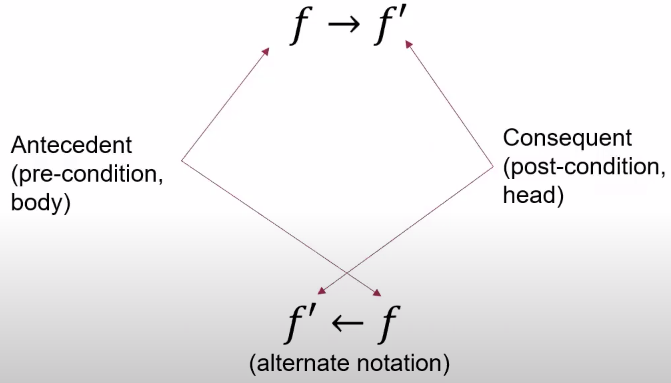

Understanding Key Concepts
==========================

.. _rule:
Rule
~~~~

A rule is a statement that establishes a relationship between
premises and a conclusion, allowing for the derivation of the
conclusion if the premises are true. Rules are foundational to
logical systems, facilitating the inference process.

Every rule has a head and a body. The head determines what will
change in the graph if the body is true.

.. _fact:
Fact
~~~~

A fact is a statement that is used to store information in the graph. It is a basic unit
of knowledge that is used to derive new information. It can be thought of as an initial condition before reasoning.
Facts are used to initialize the graph and are the starting point for reasoning.

Annotated atom
~~~~~~~~~~~~~~~~~~~~~~~~~
An annotated atom or function in logic, refers to an atomic formula (or a simple predicate) that is augmented with additional
information, such as a certainty factor, a probability, or other annotations that provide context or constraints.

In PyReason, an annotated atom is represented as a predicate with a bound, which is a list of two values that represent the lower and upper bounds of the predicate.
For example, a predicate ``pred(x,y) : [0.2, 1]`` means that the predicate ``pred(x,y)`` is true with a certainty between 0.2 and 1.

Interpretation
~~~~~~~~~~~~~~
An interpretation is a mapping from the set of atoms to the set of truth values. It is a way of assigning truth values to the atoms in the graph.

Fixed point operator
~~~~~~~~~~~~~~~~~~~~

In simple terms, a fixed point operator is a function that says if you have a set of atoms,
return that set plus any atoms that can be derived by a single application of a rule in the program.

.. _inconsistent_predicate:
Inconsistencies
~~~~~~~~~~~~~~~
A logic program is consistent if there exists an interpretation that satisfies the logic program, i.e., makes all the rules true.
If no such interpretation exists, the logic program is inconsistent.

For example if we have the following two rules:

.. code-block:: text

  rule-1: grass_wet <- rained,
  rule-2: ~grass_wet <- rained,

This creates an inconsistency because the first rule states that the grass is wet if it rained, while the second rule states that the grass is not wet if it rained.
In PyReason, inconsistencies are detected and resolved to ensure the reasoning process remains robust. In such a case,
the affected interpretations are reset to a state of complete uncertainty i.e ``grass_wet : [0,1]``.

Inconsistent predicate list
~~~~~~~~~~~~~~~~~~~~~~~~~~~

An inconsistent predicate list is a list of predicates that are inconsistent with each other.

For example, consider the following example of two predicates that are inconsistent with each other:

.. code-block:: text

    sick and healthy

In this case, the predicates "sick" and "healthy" are inconsistent with each other because they cannot both be true at the same time.
We can model this in PyReason such that when one predicate is has a certain bound ``[l, u]``, the other predicate is given
a bound ``[1-u, 1-l]`` automatically. See :ref:`here <inconsistent_predicate_list>` for more information.

In this case, if "sick" is true with a bound ``[1, 1]``, then "healthy" is automatically set to ``[0, 0]``.
