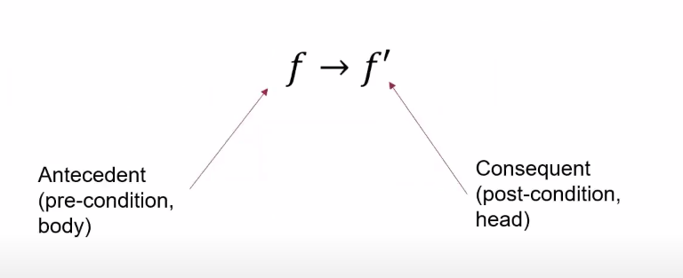

Understanding Key Concepts
==========================

What is a:
----------

RULE
~~~~

-  A rule is a statement that establishes a relationship between
   premises and a conclusion, allowing for the derivation of the
   conclusion if the premises are true. Rules are foundational to
   logical systems, facilitating the inference process. |image|
-  Every rule has a head and a body. The head determines what will
   change in the graph if the body is true.

FACT
~~~~

-  A fact is a statement that is true in the graph. It is a basic unit
   of knowledge that is used to derive new information.
-  Facts are used to initialize the graph and are the starting point for
   reasoning.

ANNOTATED ATOM / FUNCTION
~~~~~~~~~~~~~~~~~~~~~~~~~

INTERPRETATION
~~~~~~~~~~~~~~

FIXED POINT OPERATOR
~~~~~~~~~~~~~~~~~~~~

Inconsistent predicate list
~~~~~~~~~~~~~~~~~~~~~~~~~~~

