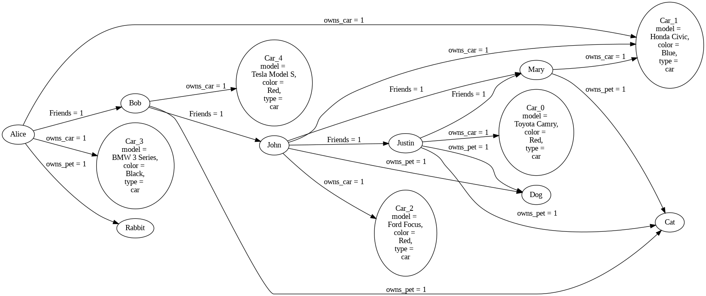

Advanced Tutorial
==========================================

In this tutorial, we will look at how to run PyReason with a more
complex graph.

.. note:: 
   Find the full, executable code `here <https://github.com/lab-v2/pyreason/blob/main/examples/advanced_graph_ex.py>`_

Graph
------------

We use a larger graph for this example. In this example , we have ``customers`` , ``cars`` , ``pets`` and their relationships.
We first have ``customer_details`` followed by ``car_details`` , ``pet_details`` , ``travel_details`` .

.. literalinclude:: advanced_graph.py
   :language: python
   :lines: 16-24, 28-34 , 39-52, 58-63

We now have the relationships between the customers , cars , pets and travel details.

.. literalinclude:: advanced_graph.py
   :language: python
   :lines: 67-78

Based on the relationships we now connect the nodes, edges and the form the graph.

.. literalinclude:: advanced_graph.py
   :language: python
   :lines: 84-124

We now have the graph ready. We can now add the rules for our use case. Take a look at it at

   advanced graph image

Rules
-----

The below are the rules we want to add:

1. A customer is popular if he is friends with a popular customer.
2. A customer has a cool car if he owns a car and the car is of type ``Car_4``.
3. A customer has a cool pet if he owns a pet and the pet is of type ``Pet_2``.
4. A customer is trendy if he has a cool car and a cool pet.

.. code-block:: python

    pr.add_rule(pr.Rule('popular(x) <-1 popular(y), Friends(x,y)', 'popular_pet_rule'))
    pr.add_rule(pr.Rule('cool_car(x) <-1 owns_car(x,y),Car_4(y)', 'cool_car_rule'))
    pr.add_rule(pr.Rule('cool_pet(x)<-1 owns_pet(x,y),Pet_2(y)', 'cool_pet_rule'))
    pr.add_rule(pr.Rule('trendy(x) <- cool_car(x) , cool_pet(x)', 'trendy_rule'))
The above rules are based on nodes. Now let us add some more rules based on the edges.

1. Two customers are ``car_friends`` if they own the same car.
2. Two customers are ``friends`` if they own the same color car.

.. code-block:: python

    pr.add_rule(pr.Rule("car_friend(x,y) <- owns_car(x,z), owns_car(y,z)", "car_friend_rule"))
    pr.add_rule(pr.Rule("same_color_car(x, y) <- owns_car(x, c1) , owns_car(y, c2)","same_car_color_rule"))

Facts
-------

We now add the facts to the graph.
There is only one fact we are going to use.
1. ``customer_0`` is popular from time ``0`` to ``5``.

.. code-block:: python

    pr.add_fact(pr.Fact(name='popular-fact', fact_text='popular(customer_0)', 0, 5))

Running Pyreason
----------------

We now run the PyReason interpretation with the graph and the rules.

.. code-block:: python

    interpretation = pr.reason(timesteps=6)
    # pr.save_rule_trace(interpretation)

    interpretations_dict = interpretation.get_dict()

    df1 = pr.filter_and_sort_nodes(interpretation, ['trendy', 'cool_car', 'cool_pet', 'popular'])
    df2 = pr.filter_and_sort_edges(interpretation, ['car_friend', 'same_color_car'])

Expected Output
---------------
Below is the expected output at timestep ``0``

.. note::
   Find the full expected output `here <https://github.com/lab-v2/pyreason/blob/main/examples/advanced_output.txt>`_

.. code:: text
   
   shortend output

   Interpretations:
   {0: {'Car_0': {},
      'Car_1': {},
      'Car_10': {},
      'Car_11': {},
      'Car_2': {},
      'Car_3': {},
      'Car_4': {},
      'Car_5': {},
      'Car_6': {},
      'Car_7': {},
      'Car_8': {},
      'Car_9': {},
      'Pet_0': {},
      'Pet_1': {},
      'Pet_2': {},
      'Pet_3': {},
      'Pet_4': {},
      'customer_0': {},
      'customer_1': {},
      'customer_2': {},
      'customer_3': {},
      'customer_4': {},
      'customer_5': {},
      'customer_6': {},
      'popular-fac': {'popular-fac': (1.0, 1.0)},
      ('customer_0', 'Car_2'): {},
      ('customer_0', 'Car_7'): {},
      ('customer_0', 'Pet_0'): {},
      ('customer_0', 'Pet_4'): {},
      ('customer_0', 'customer_1'): {'same_color_car': (1.0, 1.0)},
      ('customer_0', 'customer_2'): {'same_color_car': (1.0, 1.0)},
      ('customer_1', 'Car_0'): {},
      ('customer_1', 'Car_8'): {},
      ('customer_1', 'Pet_1'): {},
      ('customer_2', 'Car_1'): {},
      ('customer_2', 'Car_11'): {},
      ('customer_2', 'Car_3'): {},
      ('customer_2', 'Pet_0'): {},
      ('customer_2', 'Pet_1'): {},
      ('customer_2', 'customer_1'): {'same_color_car': (1.0, 1.0)},
      ('customer_3', 'Car_0'): {},
      ('customer_3', 'Car_10'): {},
      ('customer_3', 'Car_3'): {},
      ('customer_3', 'Pet_2'): {},
      ('customer_3', 'customer_1'): {'car_friend': (1.0, 1.0),
                                       'same_color_car': (1.0, 1.0)},
      ('customer_3', 'customer_4'): {'same_color_car': (1.0, 1.0)},
      ('customer_4', 'Car_4'): {},
      ('customer_4', 'Car_9'): {},
      ('customer_4', 'Pet_2'): {},
      ('customer_4', 'customer_0'): {'same_color_car': (1.0, 1.0)},
      ('customer_4', 'customer_5'): {'same_color_car': (1.0, 1.0)},
      ('customer_5', 'Car_2'): {},
      ('customer_5', 'Car_5'): {},
      ('customer_5', 'Pet_3'): {},
      ('customer_5', 'customer_3'): {'same_color_car': (1.0, 1.0)},
      ('customer_5', 'customer_6'): {'same_color_car': (1.0, 1.0)},
      ('customer_6', 'Car_4'): {},
      ('customer_6', 'Car_6'): {},
      ('customer_6', 'Pet_4'): {},
      ('customer_6', 'customer_0'): {'same_color_car': (1.0, 1.0)}},
      