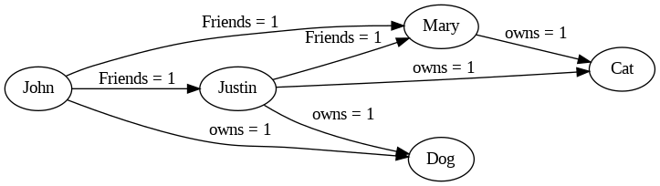

PyReason Basic Tutorial
========================

Welcome to PyReason! In this document we outline a simple program that
demonstrates some of the capabilities of the software. If this is your
first time looking at the software, you’re in the right place.

.. note:: 
   Find the full, executable code `here <https://github.com/lab-v2/pyreason/blob/main/examples/basic_tutorial_ex.py>`_

The following graph represents a network of people and the pets that
they own.

1. Mary is friends with Justin
2. Mary is friends with John
3. Justin is friends with John

And

1. Mary owns a cat
2. Justin owns a cat and a dog
3. John owns a dog

PyReason needs a few things to run:

1. A Graph (or knowledge base)
2. Rules (that determine how things can change in the graph in time)
3. Facts (that specify initial conditions in the graph. This can be specified in the graph or externally)

Graph
-----

We can create a graph in two ways:

1. Using Networkx
2. Using GraphML

Let’s look at how to create a graph using Networkx

.. code:: python

   import networkx as nx

   # ================================ CREATE GRAPH====================================
   # Create a Directed graph
   g = nx.DiGraph()

   # Add the nodes
   g.add_nodes_from(['John', 'Mary', 'Justin'])
   g.add_nodes_from(['Dog', 'Cat'])

   # Add the edges and their attributes. When an attribute = x which is <= 1, the annotation
   # associated with it will be [x,1]. NOTE: These attributes are immutable
   # Friend edges
   g.add_edge('Justin', 'Mary', Friends=1)
   g.add_edge('John', 'Mary', Friends=1)
   g.add_edge('John', 'Justin', Friends=1)

   # Pet edges
   g.add_edge('Mary', 'Cat', owns=1)
   g.add_edge('Justin', 'Cat', owns=1)
   g.add_edge('Justin', 'Dog', owns=1)
   g.add_edge('John', 'Dog', owns=1)

Reading the graph from a file is also possible. The file should be in
GraphML format.

.. code:: xml

   <?xml version='1.0' encoding='utf-8'?>
   <graphml
       xmlns="http://graphml.graphdrawing.org/xmlns"
       xmlns:xsi="http://www.w3.org/2001/XMLSchema-instance" xsi:schemaLocation="http://graphml.graphdrawing.org/xmlns http://graphml.graphdrawing.org/xmlns/1.0/graphml.xsd">
       <key id="owns" for="edge" attr.name="owns" attr.type="long" />
       <key id="Friends" for="edge" attr.name="Friends" attr.type="long" />
       <graph edgedefault="directed">
           <node id="John" />
           <node id="Mary" />
           <node id="Justin" />
           <node id="Dog" />
           <node id="Cat" />
           <edge source="John" target="Mary">
               <data key="Friends">1</data>
           </edge>
           <edge source="John" target="Justin">
               <data key="Friends">1</data>
           </edge>
           <edge source="John" target="Dog">
               <data key="owns">1</data>
           </edge>
           <edge source="Mary" target="Cat">
               <data key="owns">1</data>
           </edge>
           <edge source="Justin" target="Mary">
               <data key="Friends">1</data>
           </edge>
           <edge source="Justin" target="Cat">
               <data key="owns">1</data>
           </edge>
           <edge source="Justin" target="Dog">
               <data key="owns">1</data>
           </edge>
       </graph>
   </graphml>

We then load the graph from the NetworkX graph using the following code:

.. code:: python

   import pyreason as pr
   pr.load_graph(g)

   basic image

Both representations of the graph are equivalent and can be used
interchangeably.

Rules
-----

The rule we want to add is the one that determines popularity. We want
to add a rule that says that if a person has a friend who is popular and
who has the same pet as they do, then they are popular.

.. code:: text

   popular(x) : [1,1] <-1 popular(y) : [1,1] , Friends(x,y) : [1,1] , owns(y,z) : [1,1] , owns(x,z) : [1,1]

Since PyReason by default assumes bounds in a rule to be ``[1,1]``, we can omit them here and write:

.. code:: text

   popular(x) <-1 popular(y), Friends(x,y), owns(y,z), owns(x,z)

The rule is read as follows: - The ``head`` of the rule is
``popular(x)`` and the body is
``popular(y), Friends(x,y), owns(y,z), owns(x,z)``. The head and body
are separated by an arrow and the time after which the head will become
true ``<-1`` in our case this happens after ``1`` timestep.

To add this rule to PyReason, we can do the following:

1. Add the rule directly
2. Add the rule from a file

To add the rule directly, we must specify the rule and a name for it.

.. code:: python

   import pyreason as pr
   pr.add_rule(pr.Rule('popular(x) <-1 popular(y), Friends(x,y), owns(y,z), owns(x,z)', 'popular_rule'))

The name helps understand which rules fired during reasoning later on.

Adding the rule from a file is also possible. The file should be in
``.txt`` format and should contain the rule in the format shown above.

.. code:: text

   popular(x) <-1 popular(y), Friends(x,y), owns(y,z), owns(x,z)

Now we can load the rule from the file using the following code:

.. code:: python

   import pyreason as pr
   pr.add_rules_from_file('rules.txt')

Facts
-----

Facts are initial conditions that we want to set in the graph.

In the graph we have created, suppose we want to set ``Mary`` to be
``popular`` initially.

.. code:: python

   import pyreason as pr
   pr.add_fact(pr.Fact('popular(Mary)', 'popular_fact', 0, 2))

The fact indicates that ``Mary`` is ``popular`` at time ``0`` and will
remain so until time ``2``.

Running PyReason
----------------

The main line that runs the reasoning in that file is:

.. code:: python

   interpretation = pr.reason(timesteps=2)

This line runs the reasoning for ``2`` timesteps and returns the
interpretation of the graph at each timestep. We can also skip the
``timesteps`` argument and let PyReason run until the convergence is
reached.

Expected Output
---------------

Before checking the output , we can check manually what the expected
output should be. Since we have a small graph, we can reason through it
manually.

1. At timestep 0, we have ``Mary`` to be ``popular``.
2. At timestep 1, ``Justin`` becomes ``popular`` because he has a
   popular friend (``Mary``) and has the same pet as ``Mary`` (cat).
3. At timestep 2, ``John`` becomes ``popular`` because he has a popular
   friend (``Justin``) and has the same pet as ``Justin`` (dog).
4. At timestep 3, no new nodes become popular and the reasoning stops.

The output of the reasoning is as follows:

::

    TIMESTEP - 0
     component    popular
   0      Mary  [1.0,1.0]

    TIMESTEP - 1
     component    popular
   0      Mary  [1.0,1.0]
   1    Justin  [1.0,1.0]

    TIMESTEP - 2
     component    popular
   0      Mary  [1.0,1.0]
   1    Justin  [1.0,1.0]
   2      John  [1.0,1.0]

The output is as expected and the reasoning has converged. The reasoning
has been successful. We also output two CSV files detailing all the
events that took place during reasoning (one for nodes, one for edges)
