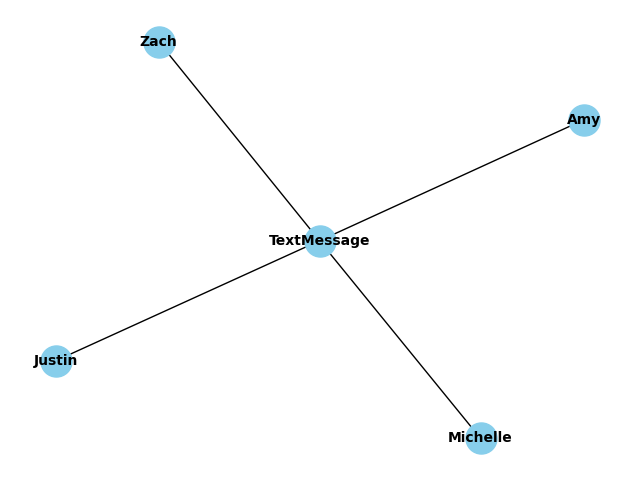

.. _custom_thresholds_tutorial:
PyReason Custom Threshold
=================================

In this tutorial, we will look at how to run PyReason with Custom Thresholds. 
Custom Thresholds are parameters in the :ref:`Rule Class <pyreason_rules>`. 

.. note::
    Find the full, excecutable code `here <https://github.com/lab-v2/pyreason/blob/main/examples/custom_threshold_ex.py>`_

The following graph represents a network of People and a Text Message in their group chat.

Graph
------------

First, we create the graph using Networkx. This graph has nodes ``Zach``, ``Justin``, ``Michelle``, ``Amy``, and ``TextMessages``.

.. code:: python

   
    import networkx as nx

    # Create an empty graph
    G = nx.Graph()

    # Add nodes
    nodes = ["TextMessage", "Zach", "Justin", "Michelle", "Amy"]
    G.add_nodes_from(nodes)

    # Add edges with attribute 'HaveAccess'
    edges = [
        ("Zach", "TextMessage", {"HaveAccess": 1}),
        ("Justin", "TextMessage", {"HaveAccess": 1}),
        ("Michelle", "TextMessage", {"HaveAccess": 1}),
        ("Amy", "TextMessage", {"HaveAccess": 1})
    ]
    G.add_edges_from(edges)

Then intialze and load the graph into PyReason with:

.. code:: python

    import pyreason as pr
    pr.load_graph(G)

Rules 
-----

Considering that we only want a text message to be considered viewed by all if it has been viewed by everyone that can view it, we define the rule as follows:

.. code-block:: text 

    ViewedByAll(x) <- HaveAccess(x,y), Viewed(y)

The ``head`` of the rule is ``ViewedByAll(x)`` and the body is ``HaveAccess(x,y), Viewed(y)``. The head and body are separated by an arrow which means the rule will start evaluating from
timestep ``0``.

Next, add in the custom thresholds. In this graph, the custom_thresholds ensure that in order for the rules to be fired, specific criteria must be met. 

.. code:: python

    import pyreason as pr
    from pyreason import Threshold

    .. code:: python

    # add custom thresholds
    user_defined_thresholds = [
        Threshold("greater_equal", ("number", "total"), 1),
        Threshold("greater_equal", ("percent", "total"), 100),
    ]

The ``user_defined_thresholds`` are a list of custom thresholds of the format: (quantifier, quantifier_type, thresh) where:
    - quantifier can be greater_equal, greater, less_equal, less, equal
    - quantifier_type is a tuple where the first element can be either number or percent and the second element can be either total or available
    - thresh represents the numerical threshold value to compare against

The custom thresholds are created corresponding to the two clauses ``(HaveAccess(x,y)`` and ``Viewed(y))`` as below:
    - ('greater_equal', ('number', 'total'), 1) (there needs to be at least one person who has access to ``TextMessage`` for the first clause to be satisfied)
    - ('greater_equal', ('percent', 'total'), 100) (100% of people who have access to ``TextMessage`` need to view the message for second clause to be satisfied)

Next, add the Rule, with the ``user_defined_thresholds`` are passed as parameters to the new Rule.  ``viewed_by_all_rule`` is the name of the rule. This helps to understand which rule/s are fired during reasoning later on.

.. code:: python

    pr.add_rule(
        pr.Rule(
            "ViewedByAll(y) <- HaveAccess(x,y), Viewed(x)",
            "viewed_by_all_rule",
            custom_thresholds=user_defined_thresholds,
        )
    )

Facts 
-----

The facts determine the initial conditions of elements in the graph. They can be specified from the graph attributes but in that
case they will be immutable later on. Adding PyReason facts gives us more flexibility.

In our case we want one person to view the ``TextMessage`` in a particular interval of timestep.
For example, we create facts stating:
    
    - ``Zach`` and ``Justin`` view the ``TextMessage`` from at timestep ``0``
    - ``Michelle`` views the ``TextMessage`` at timestep ``1``
    - ``Amy`` views the ``TextMessage`` at timestep ``2``
    - ``3`` is the last timestep the rule is active for all.

.. code:: python

    pr.add_fact(pr.Fact("Viewed(Zach)", "seen-fact-zach", 0, 3))
    pr.add_fact(pr.Fact("Viewed(Justin)", "seen-fact-justin", 0, 3))
    pr.add_fact(pr.Fact("Viewed(Michelle)", "seen-fact-michelle", 1, 3))
    pr.add_fact(pr.Fact("Viewed(Amy)", "seen-fact-amy", 2, 3))

This allows us to specify components that have an intial condition.

Running PyReason 
----------------

To run the reasoning in the file: 

.. code:: python

    # Run the program for three timesteps to see the diffusion take place
    interpretation = pr.reason(timesteps=3)

This specifies how many timesteps to run for. 

Expected output
---------------
After running the python file, the expected output is:

.. code:: text

    Timestep: 0
    Timestep: 1
    Timestep: 2
    Timestep: 3

    Converged at time: 3
    Fixed Point iterations: 6
    TIMESTEP - 0
    Empty DataFrame
    Columns: [component, ViewedByAll]
    Index: []

    TIMESTEP - 1
    Empty DataFrame
    Columns: [component, ViewedByAll]
    Index: []

    TIMESTEP - 2
        component ViewedByAll
    0  TextMessage  [1.0, 1.0]

    TIMESTEP - 3
        component ViewedByAll
    0  TextMessage  [1.0, 1.0]

1. For timestep 0, we set ``Zach -> Viewed: [1,1]`` and ``Justin -> Viewed: [1,1]`` in the facts
2. For timestep 1, ``Michelle`` views the TextMessage as stated in facts ``Michelle -> Viewed: [1,1]``.
3. For timestep 2, since ``Amy`` has just viewed the ``TextMessage``, therefore ``Amy -> Viewed: [1,1]``. As per the rule,
   since all the people have viewed the ``TextMessage``, the message is marked as ``ViewedByAll``.
