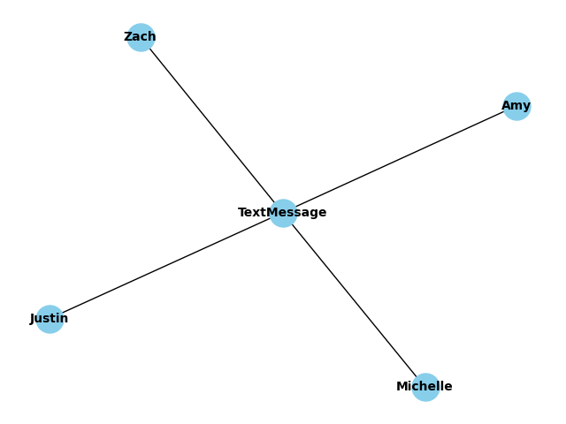

.. _forall_tutorial:

PyReason Forall Functionality
=================================

In this tutorial, we will look at how to utilize the forall function in a knowledge graph. The rule will fire only when all of the groundings of a given clause are true. 

.. note::
    Find the full, executable code `here <https://github.com/lab-v2/pyreason/blob/main/examples/forall_threshold_ex.py>`_

The following graph represents a network of People and a Text Message in their group chat. This graph is directed, meaning the relationship is not reciprocated.

Graph
------------

First, we create the graph using Networkx. This graph has nodes ``Zach``, ``Justin``, ``Michelle``, ``Amy``, and ``TextMessages``.
The graph we create is directed to show a one-sided relationship. 

.. code:: python
   
    import networkx as nx

    # Create an empty graph
    # Use a directed graph: undirected edges are loaded as two directed edges,
    # which doubles the groundings that percent thresholds count.
    G = nx.DiGraph()

    # Add nodes
    G.add_nodes_from(["TextMessage", "Zach", "Justin", "Michelle", "Amy"])
    
    # Add edges
    G.add_edges_from([
        ("Zach", "TextMessage", {"HaveAccess": 1}),
        ("Justin", "TextMessage", {"HaveAccess": 1}),
        ("Michelle", "TextMessage", {"HaveAccess": 1}),
        ("Amy", "TextMessage", {"HaveAccess": 1}),
    ])

Then initialize and load the graph into PyReason with:

.. code:: python

    import pyreason as pr
    # Clears out the state from any previous runs 
    pr.reset()
    pr.reset_rules()
    # PyReason will not print information on the screen while this runs, will utilize print statement later on. 
    pr.settings.verbose = False
    pr.load_graph(G)

Rules 
-----

Considering that we only want a text message to be considered viewed by all if it has been viewed by everyone that can view it, we define the rule as follows:

.. code-block:: python 

    pr.add_rule(pr.Rule(
        "ViewedByAll(y) <- HaveAccess(x,y), forall(Viewed(x))",
        "viewed_by_all_rule",
    ))

The ``head`` of the rule is ``ViewedByAll(y)`` and the body is ``HaveAccess(x,y), forall(Viewed(x))``. The head and body are separated by an arrow which means the rule will start evaluating from
timestep ``0``.

``Viewed(x)`` checks to see if each grounding of ``x`` is true (or in this case has viewed the message). By wrapping the clause in ``forall(...)`` it fires only once all the groundings are true (in this case viewed the message).

Facts 
-----

The facts determine the initial conditions of elements in the graph. They can be specified from the graph attributes but in that
case they will be immutable later on. Adding PyReason facts gives us more flexibility.

In our case we want one person to view the ``TextMessage`` at a particular timestep.
For example, we create facts stating:
    
    - ``Zach`` and ``Justin`` view the ``TextMessage`` from at timestep ``0``
    - ``Michelle`` views the ``TextMessage`` at timestep ``1``
    - ``Amy`` views the ``TextMessage`` at timestep ``2``
    - ``3`` is the last timestep the rule is active for all.

This allows us to see at what timestamp the ``forall(..)`` rule fires. 

.. code:: python

    pr.add_fact(pr.Fact("Viewed(Zach)", "seen-fact-zach", 0, 3))
    pr.add_fact(pr.Fact("Viewed(Justin)", "seen-fact-justin", 0, 3))
    pr.add_fact(pr.Fact("Viewed(Michelle)", "seen-fact-michelle", 1, 3))
    pr.add_fact(pr.Fact("Viewed(Amy)", "seen-fact-amy", 2, 3))

Running PyReason 
----------------

To run the reasoning in the file: 

.. code:: python

    # Run the program for three timesteps to see the forall(..) function fire
    interpretation = pr.reason(timesteps=3)

    # filter and sort nodes based on specific attributes
    dataframes = pr.filter_and_sort_nodes(interpretation, ["ViewedByAll"])
    # Display filtered node and edge data
    for t, df in enumerate(dataframes):
        print(f"TIMESTEP - {t}")
        print(df)
        print()

This specifies how many timesteps to run for.
This formats the output to display the filtered node and edge data.

Expected output
---------------
After running the python file, the expected output is:

.. code:: text

    Added  0 graph-attribute node facts and  4 graph_attribute edge facts.

    TIMESTEP - 0
    Empty DataFrame
    Columns: [component, ViewedByAll]
    Index: []

    TIMESTEP - 1
    Empty DataFrame
    Columns: [component, ViewedByAll]
    Index: []

    TIMESTEP - 2
         component ViewedByAll
    0  TextMessage  [1.0, 1.0]

    TIMESTEP - 3
         component ViewedByAll
    0  TextMessage  [1.0, 1.0]

1. For timestep 0, we set ``Zach -> Viewed: [1,1]`` and ``Justin -> Viewed: [1,1]`` in the facts
2. For timestep 1, ``Michelle`` views the TextMessage as stated in facts ``Michelle -> Viewed: [1,1]``.
3. For timestep 2, since ``Amy`` has just viewed the ``TextMessage``, therefore ``Amy -> Viewed: [1,1]``. As per the rule,
   since all the people have viewed the ``TextMessage``, the message is marked as ``ViewedByAll``.
