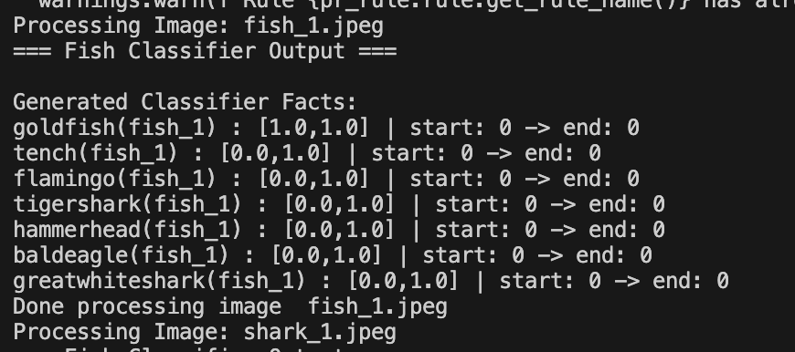
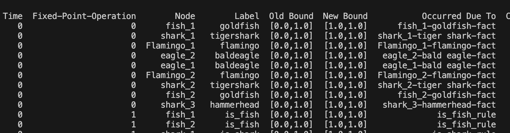

Image Classifier to PyReason Tutorial
=====================================

This tutorial shows how to use an image classifier as input to PyReason,
then reason over those predictions using logical rules.
To learn more about the LLM used for this tutorial go to: https://huggingface.co/google/vit-base-patch16-224

We will walk through four steps:

Step 1: Load the model

Step 2: Define allowed labels and rules

Step 3: Convert model output into facts

Step 4: Run reasoning and inspect output

The accompanying runnable script is in ``examples/image_classifier_ex.py``.

.. warning::
   Only use labels that exist in the classifier's label space.
   If you add labels that the model does not support, those labels will
   never be produced as high-confidence facts, and your downstream logic can
   become misleading.

.. warning::
   The model used in this example (``google/vit-base-patch16-224``) follows
   ImageNet-style labels. Before adding new species/classes to
   ``allowed_labels``, verify they exist in ``model.config.id2label``.

Overview
--------

The pipeline in this example is:

1. Load a pretrained vision model from Hugging Face.
2. Read local ``.jpeg`` images from ``examples/images``.
3. Convert classifier outputs into PyReason facts.
4. Add domain rules (fish, shark, bird, eagle, can_fly).
5. Run ``reason()`` and inspect node/edge rule traces.

Step 1: Load the model
----------------------

We load a pretrained image classifier and processor:

.. code:: python

   from transformers import AutoImageProcessor, AutoModelForImageClassification

   model_name = "google/vit-base-patch16-224"
   processor = AutoImageProcessor.from_pretrained(model_name)
   model = AutoModelForImageClassification.from_pretrained(model_name)

Step 2: Define allowed labels and rules
---------------------------------------

The model can output many classes, but we restrict reasoning to a selected set
that fits our scenario.

.. code:: python

   allowed_labels = [
       'goldfish',
       'tiger shark',
       'hammerhead',
       'great white shark',
       'tench',
       'flamingo',
       'bald eagle'
   ]

Rules then map species-level predictions into abstract concepts:

- ``is_fish(x)``
- ``is_shark(x)``
- ``is_bird(x)``
- ``is_eagle(x)``
- ``can_fly(x)``
- ``likes_to_eat(y, x)``

.. code:: python

   add_rule(Rule("is_fish(x) <-0 goldfish(x)", "is_fish_rule"))
   add_rule(Rule("is_fish(x) <-0 tench(x)", "is_fish_rule"))

   add_rule(Rule("is_shark(x) <-0 tigershark(x)", "is_shark_rule"))
   add_rule(Rule("is_shark(x) <-0 hammerhead(x)", "is_shark_rule"))
   add_rule(Rule("is_shark(x) <-0 greatwhiteshark(x)", "is_shark_rule"))
   add_rule(Rule("is_scary(x) <-0 is_shark(x)", "is_scary_rule"))

   add_rule(Rule("is_flamingo(x) <-0 flamingo(x)", "is_flamingo_rule"))
   add_rule(Rule("is_bird(x) <-0 flamingo(x)", "is_bird_rule"))
   add_rule(Rule("is_eagle(x) <-0 baldeagle(x)", "is_eagle_rule"))
   add_rule(Rule("is_bird(x) <-0 baldeagle(x)", "is_bird_rule"))
   add_rule(Rule("can_fly(x) <-0 is_bird(x)", "can_fly_rule"))

   add_rule(Rule("likes_to_eat(y,x) <-0 is_shark(y), is_fish(x)", "likes_to_eat_rule", infer_edges=True))
   add_rule(Rule("likes_to_eat(y,x) <-0 is_flamingo(y), is_fish(x)", "likes_to_eat_rule", infer_edges=True))

Step 3: Convert model output into facts
---------------------------------------

Each image is processed by ``HuggingFaceLogicIntegratedClassifier`` and turned
into PyReason facts with bounds.

.. code:: python

   classifier = HuggingFaceLogicIntegratedClassifier(
       model,
       allowed_labels,
       identifier=classifier_name,
       interface_options=interface_options,
       limit_classes=True
   )

   logits, probabilities, classifier_facts = classifier(inputs)

   for fact in classifier_facts:
       add_fact(fact)

Examples of generated facts:

.. code:: text

   goldfish(fish_1) : [1.0,1.0] | start: 0 -> end: 0
   tigershark(shark_1) : [1.0,1.0] | start: 0 -> end: 0
   flamingo(Flamingo_1) : [1.0,1.0] | start: 0 -> end: 0
   baldeagle(eagle_1) : [1.0,1.0] | start: 0 -> end: 0

Step 4: Run reasoning and inspect output
----------------------------------------

After facts and rules are loaded, run PyReason:

.. code:: python

   Settings.atom_trace = True
   interpretation = reason()
   trace = get_rule_trace(interpretation)
   print(trace[0])  # node trace
   print(trace[1])  # edge trace

This prints which rules fired on which nodes and edges.

Expected output: classifier (by image group)
--------------------------------------------

For each photo the script prints one block: filename, then one line per label
in ``allowed_labels``. The label that matches what the model thinks the photo
is gets a tight bound ``[1.0, 1.0]``. The other labels still print, but with
``[0.0, 1.0]``. That is the model not picking that class for this image. It is
not the same as ``[0.0, 0.0]`` on both ends.

Fish image trace
^^^^^^^^^^^

.. code:: text

   Processing Image: fish_1.jpeg
   === Fish Classifier Output ===

   Generated Classifier Facts:
   goldfish(fish_1) : [1.0,1.0] | start: 0 -> end: 0
   tench(fish_1) : [0.0,1.0] | start: 0 -> end: 0
   flamingo(fish_1) : [0.0,1.0] | start: 0 -> end: 0
   tigershark(fish_1) : [0.0,1.0] | start: 0 -> end: 0
   hammerhead(fish_1) : [0.0,1.0] | start: 0 -> end: 0
   baldeagle(fish_1) : [0.0,1.0] | start: 0 -> end: 0
   greatwhiteshark(fish_1) : [0.0,1.0] | start: 0 -> end: 0
   Done processing image  fish_1.jpeg

After classification: what PyReason does next
--------------------------------------------

Reasoning runs at timestep ``0`` and finishes in three fixed-point passes (you
will see ``Fixed Point iterations: 3`` in the log).

**Pass 0.** Facts on the graph. The trace rows with ``Fixed-Point-Operation``
``0`` are the classifier facts: each image node gets its winning species as a
predicate (``goldfish``, ``tigershark``, ``flamingo``, ``baldeagle``, etc.).
``Occurred Due To`` points at the fact name that fired.

**Pass 1.** Group the animals. The rules lift those facts into ``is_fish``,
``is_shark``, ``is_flamingo``, ``is_eagle``, and ``is_bird``. A bald eagle ends
up with both ``is_eagle`` and ``is_bird`` because two different rules match.

**Pass 2.** Extra facts and edges. From ``is_shark`` you get ``is_scary``. From
``is_bird`` you get ``can_fly`` for flamingos and eagles. The ``likes_to_eat``
edges show up here too (sharks and flamingos both use rules named ``likes_to_eat``
toward fish nodes).

Full node and edge traces for this example are saved under
``examples/csv_outputs/image_classifier_rule_trace_nodes.csv`` and
``examples/csv_outputs/image_classifier_rule_trace_edges.csv``.

.. warning::
   Node and edge traces are printed as pandas tables. A narrow terminal may hide
   columns in the middle and show ``...``. Widen the terminal or print with
   ``to_string()`` if you need every column.

Sample end of run
^^^^^^^^^^^^^^^^^

Common Pitfalls
---------------

1. If you see many ``[0.0,1.0]`` facts and very few ``[1.0,1.0]`` facts,
   your image may not match the selected allowed labels well.

2. If a class never appears, confirm:

   - the class exists in ``model.config.id2label``
   - the class spelling in ``allowed_labels`` matches model labels
   - your image set actually contains that visual concept clearly

