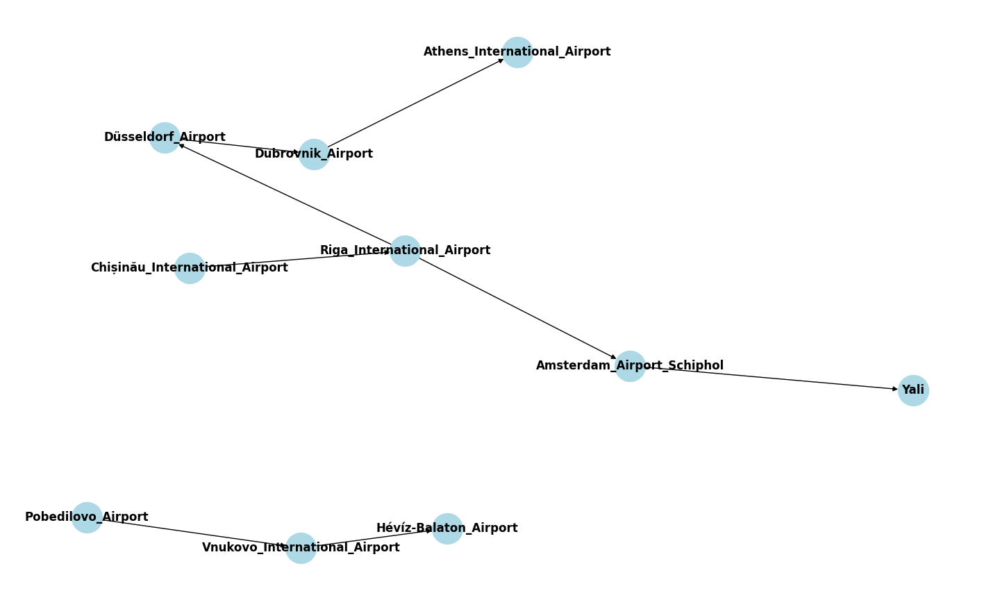
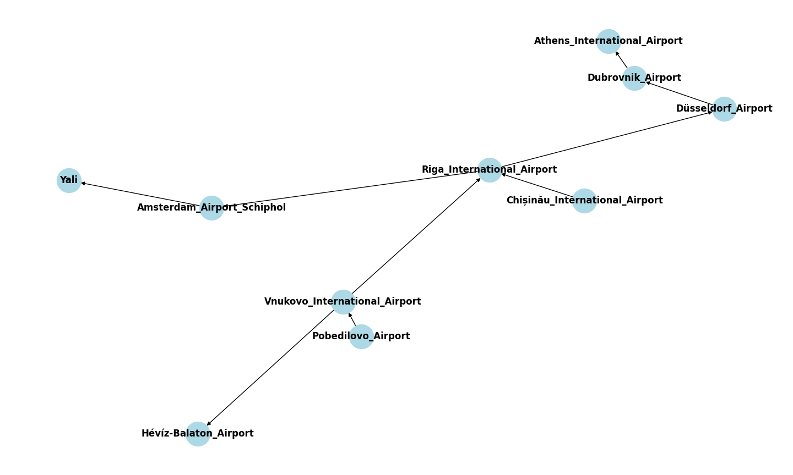

PyReason Infer Edges 
============================

In this tutorial, we will look at how to run PyReason with infer edges. 
infer edges is a parameter in the :ref:`Rule Class <pyreason_rules>`. 

.. note::
    Find the full, excecutable code `here <https://github.com/lab-v2/pyreason/blob/main/examples/infer_edges_ex.py>`_

The following graph represents a network of airports and connections.

Graph
------------

First, we create the graph in Networkx. This graph has airports and flight connections.

.. code:: python

    import networkx as nx

    # Create a directed graph
    G = nx.DiGraph()

    # Add nodes with attributes
    nodes = [
        ("Amsterdam_Airport_Schiphol", {"Amsterdam_Airport_Schiphol": 1}),
        ("Riga_International_Airport", {"Riga_International_Airport": 1}),
        ("Chișinău_International_Airport", {"Chișinău_International_Airport": 1}),
        ("Yali", {"Yali": 1}),
        ("Düsseldorf_Airport", {"Düsseldorf_Airport": 1}),
        ("Pobedilovo_Airport", {"Pobedilovo_Airport": 1}),
        ("Dubrovnik_Airport", {"Dubrovnik_Airport": 1}),
        ("Hévíz-Balaton_Airport", {"Hévíz-Balaton_Airport": 1}),
        ("Athens_International_Airport", {"Athens_International_Airport": 1}),
        ("Vnukovo_International_Airport", {"Vnukovo_International_Airport": 1})
    ]

    G.add_nodes_from(nodes)

    # Add edges with 'isConnectedTo' attribute
    edges = [
        ("Pobedilovo_Airport", "Vnukovo_International_Airport", {"isConnectedTo": 1}),
        ("Vnukovo_International_Airport", "Hévíz-Balaton_Airport", {"isConnectedTo": 1}),
        ("Düsseldorf_Airport", "Dubrovnik_Airport", {"isConnectedTo": 1}),
        ("Dubrovnik_Airport", "Athens_International_Airport", {"isConnectedTo": 1}),
        ("Riga_International_Airport", "Amsterdam_Airport_Schiphol", {"isConnectedTo": 1}),
        ("Riga_International_Airport", "Düsseldorf_Airport", {"isConnectedTo": 1}),
        ("Chișinău_International_Airport", "Riga_International_Airport", {"isConnectedTo": 1}),
        ("Amsterdam_Airport_Schiphol", "Yali", {"isConnectedTo": 1})
    ]

    G.add_edges_from(edges)

We can also load the graph from a GraphML `file <https://github.com/lab-v2/pyreason/blob/main/tests/knowledge_graph_test_subset.graphml>`_

We then initialize and load the graph using the following code:

.. code:: python

    import pyreason as pr

    pr.reset()
    pr.reset_rules()
    # Modify pyreason settings to make verbose and to save the rule trace to a file
    pr.settings.verbose = True
    pr.settings.atom_trace = True
    pr.settings.memory_profile = False
    pr.settings.canonical = True
    pr.settings.inconsistency_check = False
    pr.settings.static_graph_facts = False
    pr.settings.output_to_file = False
    pr.settings.store_interpretation_changes = True
    pr.settings.save_graph_attributes_to_trace = True
    # Load all the files into pyreason
    pr.load_graph(G)

Rules
------------

Next, add the Rule and set ``infer_edges`` to ``True``

.. code:: python

    pr.add_rule(pr.Rule('isConnectedTo(A, Y) <-1  isConnectedTo(Y, B), Amsterdam_Airport_Schiphol(B), Vnukovo_International_Airport(A)', 'connected_rule_1', infer_edges=True))

This will should connect exactly one new relationship from A to Y. The Rule states that if there is a connection from Y to B, then infer an edge from A to Y.
    
    - B is ``Amsterdam Airport Schiphol``
    - Y is ``Riga_International_Airport``
    - A is ``Vnukovo_International_Airport``

Therefore the output of the graph after running 1 timestep should be a new connection [1,1] between ``Vnukovo_International_Airport`` (A) to ``Riga_International_Airport`` (Y).

Facts 
-----
This example does not havea any facts. All initial conditions are set when the graph is created

Running PyReason 
----------------

Run the program for ``1`` timesteps.

.. code:: python

    # Run the program for one timesteps to see the diffusion take place

    interpretation = pr.reason(timesteps=1)

Expected output
---------------
After running the python file, the expected output is:
   
The expected output after running will list at timestep 0 the inital connections and timestep 1 the added connection due to the ``infer_edges`` parameter. 

.. code:: text

    Timestep: 0
    Timestep: 1

    Converged at time: 1
    Fixed Point iterations: 2
    TIMESTEP - 0
                                            component isConnectedTo
    0                 (Amsterdam_Airport_Schiphol, Yali)    [1.0, 1.0]
    1  (Riga_International_Airport, Amsterdam_Airport...    [1.0, 1.0]
    2   (Riga_International_Airport, Düsseldorf_Airport)    [1.0, 1.0]
    3  (Chișinău_International_Airport, Riga_Internat...    [1.0, 1.0]
    4            (Düsseldorf_Airport, Dubrovnik_Airport)    [1.0, 1.0]
    5  (Pobedilovo_Airport, Vnukovo_International_Air...    [1.0, 1.0]
    6  (Dubrovnik_Airport, Athens_International_Airport)    [1.0, 1.0]
    7  (Vnukovo_International_Airport, Hévíz-Balaton_...    [1.0, 1.0]

    TIMESTEP - 1
                                            component isConnectedTo
    0  (Vnukovo_International_Airport, Riga_Internati...    [1.0, 1.0]

The graph after running shows a new connection from ``Vnukovo_International_Airport``  to ``Riga_International_Airport``, because during the reasoning process an edges between them was infered. 

